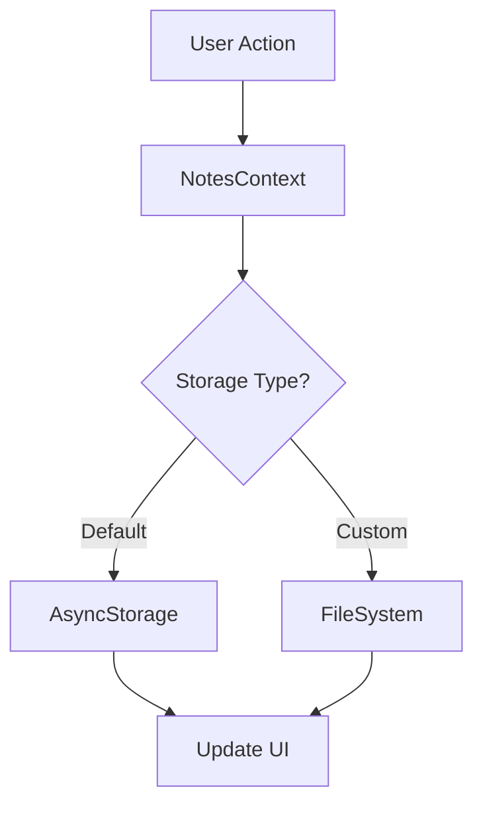
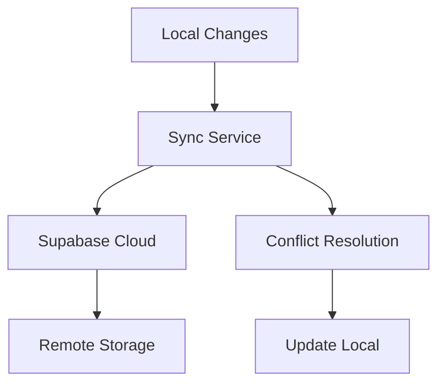

# Phân tích: Các phương thức tương tác với bộ nhớ trong React Native Expo

## Tổng quan

Dự án hiện tại sử dụng một kiến trúc storage đa tầng với nhiều phương thức tương tác khác nhau để đảm bảo tính linh hoạt, bảo mật và hiệu suất.

## 🗄️ Các phương thức Storage chính

### 1. AsyncStorage (React Native AsyncStorage)
**Package**: `@react-native-async-storage/async-storage`
**Mục đích**: Local storage không đồng bộ, persistent
**Sử dụng cho**:
- Lưu trữ notes chính (noteService.ts)
- Cấu hình storage location (storageLocationService.ts)
- Web platform authentication (authService.ts)

```typescript
// Ví dụ sử dụng
import AsyncStorage from '@react-native-async-storage/async-storage';

// Lưu notes
await AsyncStorage.setItem(NOTES_KEY, JSON.stringify(notes));

// Đọc notes
const notesJson = await AsyncStorage.getItem(NOTES_KEY);
const notes = notesJson ? JSON.parse(notesJson) : [];

// Xóa tất cả dữ liệu
await AsyncStorage.clear();
```

### 2. Expo FileSystem
**Package**: `expo-file-system`
**Mục đích**: Tương tác với hệ thống file native
**Sử dụng cho**:
- Custom storage locations (enhancedNoteService.ts)
- File export/import (storageService.ts)
- iOS storage optimization (iOSStorageService.ts)
- Directory management (storageLocationService.ts)

```typescript
// Ví dụ sử dụng
import * as FileSystem from 'expo-file-system';

// Đọc file
const content = await FileSystem.readAsStringAsync(filePath);

// Ghi file
await FileSystem.writeAsStringAsync(filePath, JSON.stringify(data));

// Kiểm tra file tồn tại
const info = await FileSystem.getInfoAsync(filePath);

// Tạo thư mục
await FileSystem.makeDirectoryAsync(path, { intermediates: true });

// Lấy thông tin dung lượng
const freeSpace = await FileSystem.getFreeDiskStorageAsync();
```

### 3. Expo SecureStore
**Package**: `expo-secure-store`
**Mục đích**: Lưu trữ bảo mật cho dữ liệu nhạy cảm
**Sử dụng cho**:
- Authentication tokens (authService.ts)
- Secure session storage (native platforms)

```typescript
// Ví dụ sử dụng
import * as SecureStore from 'expo-secure-store';

// Lưu dữ liệu bảo mật
await SecureStore.setItemAsync(key, value);

// Đọc dữ liệu bảo mật
const value = await SecureStore.getItemAsync(key);

// Xóa dữ liệu bảo mật
await SecureStore.deleteItemAsync(key);
```

### 4. Supabase Storage
**Package**: `@supabase/supabase-js`
**Mục đích**: Cloud storage và synchronization
**Sử dụng cho**:
- Remote backup (syncService.ts)
- Cross-device synchronization
- User authentication

```typescript
// Ví dụ sử dụng
import { createClient } from '@supabase/supabase-js';

// Sync notes to cloud
const { data, error } = await supabase
  .from('notes')
  .upsert(notesToUpload);

// Get remote notes
const { data: remoteNotes } = await supabase
  .from('notes')
  .select('*')
  .eq('user_id', userId);
```

## 🏗️ Kiến trúc Storage

### Storage Service Layer
```
┌─────────────────────────────────────────┐
│           Application Layer             │
├─────────────────────────────────────────┤
│  noteService.ts (Basic CRUD)           │
│  enhancedNoteService.ts (Advanced)     │
│  storageService.ts (Export/Import)      │
│  syncService.ts (Cloud Sync)           │
├─────────────────────────────────────────┤
│  storageLocationService.ts              │
│  iOSStorageService.ts (iOS Specific)    │
├─────────────────────────────────────────┤
│  AsyncStorage | FileSystem | SecureStore│
└─────────────────────────────────────────┘
```

### Storage Strategy
1. **Default Storage**: AsyncStorage (compatibility)
2. **Custom Location**: FileSystem (flexibility)
3. **Secure Data**: SecureStore (security)
4. **Cloud Backup**: Supabase (sync)

## 📱 Platform-specific Implementations

### Android Storage
```typescript
// Android-specific storage options
const androidStorageOptions = [
  {
    path: FileSystem.documentDirectory,
    type: 'internal',
    description: 'App internal storage'
  },
  {
    path: FileSystem.cacheDirectory,
    type: 'cache',
    description: 'Temporary cache storage'
  }
];
```

### iOS Storage
```typescript
// iOS-specific storage with security scoping
const iOSStorageOptions = [
  {
    path: FileSystem.documentDirectory,
    type: 'app_documents',
    securityScoped: true,
    iCloudSync: true
  },
  {
    path: 'Files App Integration',
    type: 'files_app',
    requiresPermission: true
  }
];
```

## 🔄 Data Flow và Synchronization

### Local Storage Flow


### Sync Flow


## 🛠️ Service Implementations

### 1. NoteService (Basic)
- **Storage**: AsyncStorage
- **Features**: CRUD operations, search, favorites
- **Performance**: Fast, synchronous-like API
- **Limitations**: Single storage location

### 2. EnhancedNoteService (Advanced)
- **Storage**: AsyncStorage + FileSystem
- **Features**: Custom locations, file-based storage
- **Performance**: Flexible, location-aware
- **Benefits**: User-controlled storage paths

### 3. StorageLocationService
- **Purpose**: Manage storage locations
- **Features**: Validation, migration, space monitoring
- **Storage**: AsyncStorage (config) + FileSystem (validation)

### 4. iOSStorageService
- **Purpose**: iOS-specific optimizations
- **Features**: Security scoping, iCloud integration
- **iOS 16+**: Enhanced file system access
- **Battery**: Optimized background operations

## 🔐 Security Considerations

### Data Classification
1. **Public Data**: Notes content → AsyncStorage/FileSystem
2. **Sensitive Data**: Auth tokens → SecureStore
3. **Configuration**: App settings → AsyncStorage
4. **Temporary**: Cache data → FileSystem.cacheDirectory

### Encryption
```typescript
// SecureStore automatically encrypts data
await SecureStore.setItemAsync('auth_token', token);

// FileSystem requires manual encryption if needed
const encryptedData = encrypt(sensitiveData);
await FileSystem.writeAsStringAsync(path, encryptedData);
```

## 📊 Performance Optimizations

### 1. Lazy Loading
```typescript
// Load notes only when needed
const { notes, loading } = useNotes();
```

### 2. Caching Strategy
```typescript
// Memory cache for frequently accessed data
private notesCache: Map<string, Note> = new Map();
```

### 3. Batch Operations
```typescript
// Batch multiple operations
await AsyncStorage.multiSet([
  ['notes', JSON.stringify(notes)],
  ['config', JSON.stringify(config)]
]);
```

### 4. Background Sync
```typescript
// iOS background app refresh
await iOSStorageService.setupiOSBackgroundSync();
```

## 🔧 Configuration và Setup

### Dependencies
```json
{
  "@react-native-async-storage/async-storage": "2.1.2",
  "expo-file-system": "~17.1.6",
  "expo-secure-store": "~14.2.3",
  "@supabase/supabase-js": "^2.39.7"
}
```

### Environment Setup
```typescript
// .env configuration
EXPO_PUBLIC_SUPABASE_URL=your-supabase-url
EXPO_PUBLIC_SUPABASE_ANON_KEY=your-anon-key
```

## 🚀 Best Practices được áp dụng

### 1. Error Handling
```typescript
try {
  await storageOperation();
} catch (error) {
  console.error('Storage error:', error);
  // Fallback to alternative storage
  await fallbackStorage();
}
```

### 2. Data Validation
```typescript
const isValid = await storageLocationService.validateStorageLocation(path);
if (!isValid) {
  throw new Error('Invalid storage location');
}
```

### 3. Migration Support
```typescript
// Automatic migration between storage types
if (currentLocation !== defaultLocation) {
  await migrateToNewLocation(oldPath, newPath);
}
```

### 4. Platform Adaptation
```typescript
// Platform-specific storage adapters
const storageAdapter = Platform.OS === 'web' 
  ? AsyncStorageAdapter 
  : SecureStoreAdapter;
```

## 🔍 Monitoring và Debugging

### Storage Info Hook
```typescript
const { storageInfo, loading, error } = useStorageInfo();
// Provides: totalNotes, totalSize, freeSpace, currentLocation
```

### iOS Optimization Hook
```typescript
const { optimizations, isSupported } = useIOSOptimization();
// Monitors: battery optimization, background sync, iCloud status
```

## 📈 Scalability Considerations

### 1. Large Dataset Handling
- Pagination for note lists
- Lazy loading of note content
- Efficient search indexing

### 2. Multi-device Sync
- Conflict resolution strategies
- Incremental sync
- Offline-first approach

### 3. Storage Limits
- Automatic cleanup of old data
- Compression for large notes
- User-configurable retention policies

## 🎯 Kết luận

Dự án sử dụng một kiến trúc storage hybrid sophisticated với:

1. **Multi-layer approach**: AsyncStorage, FileSystem, SecureStore, Cloud
2. **Platform optimization**: iOS-specific enhancements
3. **User flexibility**: Custom storage locations
4. **Security-first**: Appropriate storage for different data types
5. **Performance focus**: Caching, lazy loading, batch operations
6. **Reliability**: Error handling, fallbacks, validation

Kiến trúc này đảm bảo tính linh hoạt, bảo mật và hiệu suất cao cho ứng dụng note-taking trên cả Android và iOS.