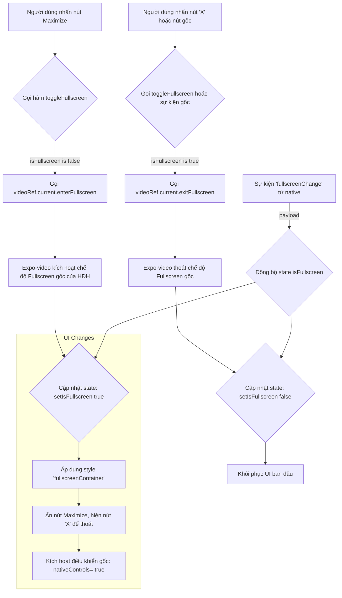

# Phân Tích Chế Độ Toàn Màn Hình (Fullscreen) trong VideoPlayer

Tài liệu này phân tích cách thành phần `VideoPlayer` triển khai và quản lý chế độ xem video toàn màn hình trong ứng dụng SuperNote.

## Tổng Quan

Chức năng trình phát video được xây dựng bằng cách sử dụng thư viện `expo-video`. Thành phần tùy chỉnh `VideoPlayer.tsx` của chúng ta hoạt động như một lớp vỏ (wrapper) xung quanh thành phần `VideoView` gốc do `expo-video` cung cấp, cho phép chúng ta tạo các điều khiển tùy chỉnh và quản lý trạng thái.

## Cơ Chế Hoạt Động

Cơ chế toàn màn hình dựa trên sự kết hợp giữa quản lý trạng thái trong React, các phương thức và thuộc tính do `expo-video` cung cấp, và các thay đổi về kiểu dáng (styling) giao diện người dùng.

### 1. Các Thành Phần Chính

*   **Thư viện:** `expo-video`
*   **Component Gốc:** `VideoView`
*   **Component Tùy Chỉnh:** `VideoPlayer.tsx`
*   **State Quản lý:** `const [isFullscreen, setIsFullscreen] = useState(false);`

### 2. Luồng Kích Hoạt và Thực Thi

### 3. Phân Tích Chi Tiết

*   **Kích hoạt Fullscreen**:
    *   Người dùng nhấn vào biểu tượng `Maximize2` trong các điều khiển tùy chỉnh.
    *   Hàm `toggleFullscreen()` được gọi.
    *   Nó kiểm tra trạng thái `isFullscreen`. Nếu là `false`, nó sẽ gọi phương thức `videoRef.current.enterFullscreen()`. Đây là một lệnh gọi không đồng bộ tới API gốc của nền tảng để chuyển trình phát video sang chế độ toàn màn hình.
    *   Trạng thái `isFullscreen` được cập nhật thành `true`.

*   **Thay Đổi Giao Diện Người Dùng (UI)**:
    *   Khi `isFullscreen` là `true`, kiểu dáng của vùng chứa video chính sẽ chuyển sang `styles.fullscreenContainer`, sử dụng `position: 'absolute'` và `zIndex` để phủ lên toàn bộ màn hình.
    *   Các điều khiển tùy chỉnh của chúng ta sẽ thay đổi: nút `Maximize2` bị ẩn và nút `X` (để thoát) được hiển thị.
    *   Quan trọng nhất, thuộc tính `nativeControls` của `VideoView` được đặt thành `true` (`nativeControls={isFullscreen}`). Điều này hướng dẫn `expo-video` hiển thị các điều khiển video gốc của hệ điều hành (iOS/Android) thay cho các điều khiển tùy chỉnh của chúng ta. Đây là một hành vi được ghi nhận trong tài liệu của Expo.

*   **Thoát Fullscreen**:
    *   Người dùng có thể thoát bằng cách nhấn vào nút `X` tùy chỉnh của chúng ta (gọi lại `toggleFullscreen()`, lần này sẽ thực thi `exitFullscreen()`) hoặc bằng cách sử dụng các điều khiển gốc (ví dụ: nhấn nút "Done" trên trình phát video của iOS).
    *   Khi một hành động gốc xảy ra, `expo-video` sẽ phát ra sự kiện `fullscreenChange`.

*   **Đồng bộ hóa Trạng thái**:
    *   Chúng ta đã đăng ký một trình lắng nghe cho sự kiện `fullscreenChange` từ trình phát video.
    *   Khi sự kiện này được kích hoạt (ví dụ: người dùng thoát toàn màn hình bằng nút gốc), trình lắng nghe sẽ nhận được trạng thái toàn màn hình mới và cập nhật trạng thái `isFullscreen` của thành phần React. Điều này đảm bảo rằng giao diện người dùng của chúng ta luôn đồng bộ với trạng thái thực của trình phát video.

## Kết Luận

Việc triển khai chế độ toàn màn hình là một sự kết hợp thông minh giữa các API do `expo-video` cung cấp và logic giao diện người dùng tùy chỉnh. Bằng cách tận dụng các phương thức `enterFullscreen`/`exitFullscreen` và lắng nghe sự kiện `fullscreenChange`, chúng ta có thể cung cấp một trải nghiệm liền mạch, đồng thời chuyển giao quyền kiểm soát cho các thành phần gốc của nền tảng khi ở chế độ toàn màn hình để đảm bảo tính nhất quán và hiệu suất.