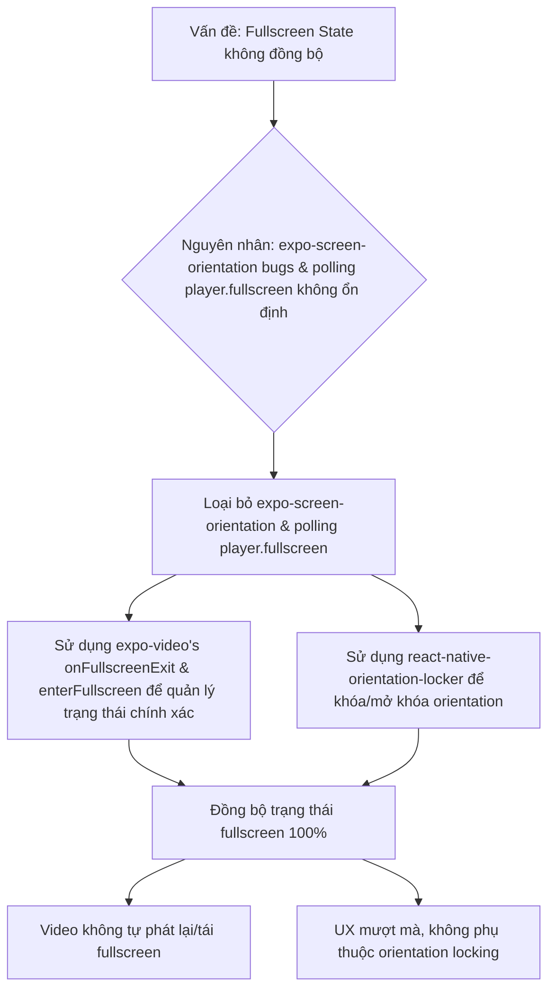

# Kế hoạch Tối ưu hóa Quản lý Fullscreen trong SuperNote

## 1. Bối cảnh và Vấn đề

Ứng dụng SuperNote đang gặp vấn đề với việc quản lý trạng thái toàn màn hình (fullscreen) khi phát video bằng `expo-video`. Các vấn đề chính bao gồm:

- Trạng thái `isFullscreen` không cập nhật chính xác khi thoát toàn màn hình.
- Video tự động phát lại và quay trở lại chế độ toàn màn hình nhiều lần.
- Polling thuộc tính `player.fullscreen` không ổn định.
- Thư viện `expo-screen-orientation` có các lỗi nghiêm trọng trên iOS, khiến nó không đáng tin cậy để quản lý orientation.

## 2. Phân tích các Kế hoạch Hiện có

### 2.1. Kế hoạch "Video Events Approach" (`doc2/fullscreen-fix-plan-ScreenOrientation.md`)

- **Khuyến nghị chính**: Sử dụng các sự kiện `onFullscreenPlayerWillPresent` và `onFullscreenPlayerWillDismiss` từ `expo-video`.
- **Đánh giá**: Các sự kiện này **không tồn tại** trong API hiện tại của `expo-video`. `expo-video` chỉ cung cấp `onFullscreenExit` và khả năng điều khiển toàn màn hình theo chương trình (`enterFullscreen()`). Điều này làm cho khuyến nghị chính trong tài liệu này không khả thi.
- **Giải pháp thay thế**: "Custom Modal Fullscreen" là một lựa chọn khả thi nhưng có thể phức tạp hơn và không tận dụng được hiệu suất native.

### 2.2. Kế hoạch "SuperNote Fullscreen Implementation Plan" (`doc2/supernote-fullscreen-implementation-plan.md`)

- **Giải pháp đề xuất**: Thay thế `expo-screen-orientation` bằng `react-native-orientation-locker` và sử dụng cách tiếp cận dựa trên orientation để quản lý trạng thái toàn màn hình.
- **Đánh giá**:
  - **Ưu điểm**: `react-native-orientation-locker` là một lựa chọn tốt hơn `expo-screen-orientation` và giải quyết được vấn đề của thư viện cũ.
  - **Nhược điểm**: Vẫn dựa vào việc suy luận trạng thái toàn màn hình từ sự thay đổi orientation. Cách tiếp cận này không hoàn toàn chính xác 100% và có thể dẫn đến các trường hợp không đồng bộ trạng thái.

## 3. Kế hoạch Tối ưu: Kết hợp `expo-video` Events và `react-native-orientation-locker`

Để đạt được giải pháp tốt nhất và đáng tin cậy nhất, chúng tôi đề xuất kết hợp các điểm mạnh từ cả hai tài liệu và thông tin đã tìm được:



### Chi tiết kế hoạch:

1.  **Loại bỏ hoàn toàn `expo-screen-orientation` và logic polling `player.fullscreen`**: Đây là nguyên nhân gốc rễ của vấn đề.

2.  **Sử dụng các sự kiện và phương thức của `expo-video` để quản lý trạng thái toàn màn hình**:
    - Sử dụng `onFullscreenExit` để cập nhật trạng thái `isFullscreen` khi người dùng thoát toàn màn hình (ví dụ: nhấn nút "Done" trên iOS).
    - Sử dụng `videoRef.current.enterFullscreen()` và `videoRef.current.exitFullscreen()` để điều khiển việc vào/thoát toàn màn hình theo chương trình.
    - Duy trì một state `isFullscreen` trong component và cập nhật nó dựa trên các sự kiện này.
      code tham khảo:

```typescript
const [isFullscreen, setIsFullscreen] = useState(false);

useEffect(() => {
  if (isFullscreen) {
    Orientation.lockToLandscape();
  } else {
    Orientation.unlockAllOrientations();
  }
  return () => Orientation.unlockAllOrientations();
}, [isFullscreen]);

<VideoView
  ref={videoRef}
  player={player}
  allowsFullscreen
  onFullscreenExit={() => setIsFullscreen(false)}
  nativeControls={isFullscreen}
/>
<Button title="Fullscreen" onPress={() => {
  setIsFullscreen(true);
  videoRef.current?.enterFullscreen();
}} />

```

3.  **Tích hợp `react-native-orientation-locker` để quản lý orientation**:
    - Khi vào toàn màn hình (sau khi gọi `enterFullscreen()`), sử dụng `Orientation.lockToLandscape()` để khóa màn hình ở chế độ ngang.
    - Khi thoát toàn màn hình (sau khi `onFullscreenExit` được kích hoạt hoặc gọi `exitFullscreen()`), sử dụng `Orientation.lockToPortrait()` hoặc `Orientation.unlockAllOrientations()` để trả về chế độ dọc hoặc cho phép xoay tự do.
    - **Lưu ý quan trọng**: Không dựa vào các sự kiện thay đổi orientation của `react-native-orientation-locker` để xác định trạng thái `isFullscreen`. Trạng thái này nên được quản lý trực tiếp bởi các sự kiện của `expo-video`. `react-native-orientation-locker` chỉ dùng để **khóa** orientation.

4.  **Quản lý StatusBar**: Ẩn StatusBar khi vào toàn màn hình và hiển thị lại khi thoát để cải thiện trải nghiệm người dùng (UX).

5.  **Xử lý lỗi và Fallback**: Đảm bảo có cơ chế xử lý lỗi nếu việc vào/thoát toàn màn hình hoặc khóa orientation thất bại.
6.  **Ghi log rõ ràng state isFullscreen** để dễ dàng debug và kiểm tra trạng thái.

## 4. Các bước tiếp theo

Sau khi kế hoạch này được chấp thuận, chúng ta sẽ chuyển sang chế độ `code` để triển khai các thay đổi.
